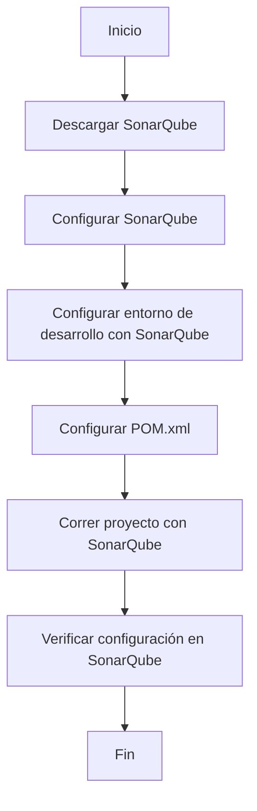

# SonarQube


se descarga la imagen desde docker hub o instanciamos un contenedor con la imagen de sonarqube

``` Bash
docker pull sonarqube ## descarga la imagen de sonarqube

docker run -d --name sonarqube_new -p 9000:9000 sonarqube ## instanciamos un contenedor con la imagen de sonarqube

```

docker run -d --gpus all --name sonarqube_new -p 9000:9000 sonarqube ## instanciamos un contenedor con la imagen de sonarqube

para iniciar el servicio de sonarqube en una applaicion Spring boot se debe agregar las siguientes dependencias en el archivo pom.xml

``` xml

<build>
    <plugins>
        <plugin>
            <groupId>org.sonarsource.scanner.maven</groupId>
            <artifactId>sonar-maven-plugin</artifactId>
            <version>3.7.0.1746</version>
        </plugin>
    </plugins>
</build>
    
```

para ejecutar el servicio de sonarqube se debe ejecutar el siguiente comando

``` Bash
mvn sonar:sonar \
-Dsonar.projectKey='nombre-proyecto-SonarQube' \
-Dsonar.host.url=http://localhost:9000 \
-Dsonar.login='token-usuario SonarQube'

```





## SonarQube Scanner 


Quality Gate es una herramienta que permite verificar la calidad del código de un proyecto, para ello se debe configurar el archivo sonar-project.properties con las siguientes propiedades
https://tomgregory.com/jenkins/sonarqube-quality-gates-in-jenkins-build-pipeline/


