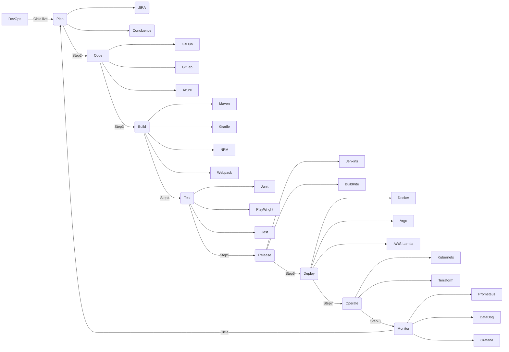

# DevOps

 Necesito un grafico que incluya los siguientes elementos:
 
 - el ciclo de vida de DevOps con las siguientes fases:
    - Plan
    - Code
    - Build
    - Test
    - Release
    - Deploy
    - Operate
    - Monitor

- Herramientas de DevOps:
  - Jenkins
  - SonarQube
  - Sonatype
  - git
  - Maven
  - Slack

Diagrama de flujo de DevOps con las herramientas mencionadas anteriormente

